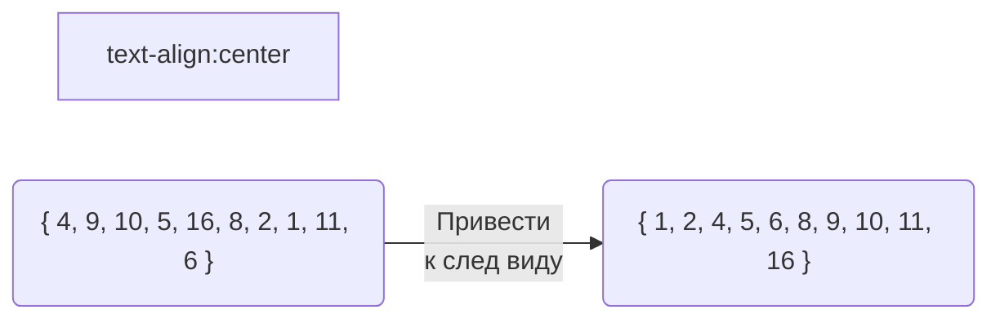

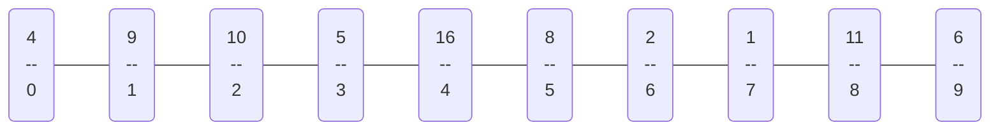

```mermaid
flowchart LR
subgraph one ["Пирамида - дерево (бинарное - двоичное)"]
    direction TB
    subgraph depth_1
        A("0")
    end
    subgraph depth_2
        B("1")
        C("2")
    end 
    subgraph depth_3
        D("3")
        E("4")
        F("5")
        G("6")
    end
    subgraph depth_4
        H("7")
        I("8")
        J("9")
    end
    
    A-->B & C
    B-->D & E
    C-->F & G
    D-->H & I
    E-->J
end
subgraph two [описание]
direction TB
style AA text-align:justify
    AA("
    Каждый элемент массива
    является корнем и/или листом
    
    у корня могу быть
    только 2 листа
    
    листы вычисляется по формуле
    (значение корня д.б. >= листов)
    arr[i] >= arr [2 * i + 1]
    arr[i] >= arr [2 * i + 2]
    
    Следовательно arr[0] д.б.
    максимальным значением
    из всего массива
    
    У пирамиды \ дерева есть
    так называемая высота \ глубина
    можно вычислить по формуле
    log&#8322;(arr.length)

    LOG основ 2 числа arr.length
    c округлением до целого числа
    в меньшую сторону")
end
one---two
```
Каждые листья необходимо сравнивать со своим корнем и максимальное (либо >=) значение должно быть корнем, т.е. рокировать при необходимости листок и корень.
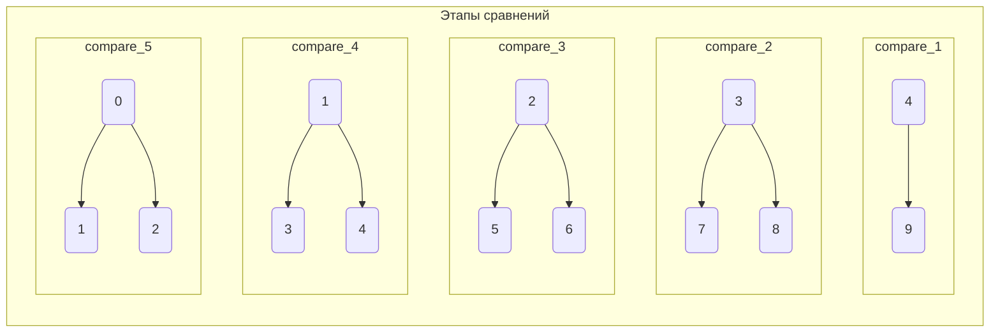
Небольшой вывод:
1. Максимальное значение должно быть `arr[0]`
2. В худшем варианте максимальное значение м.б. в конце массива
3. Следовательно необходимо проводить итерация с конца массива в начало.
4. Количество итераций должно быть `length / 2`, потому что получается, что вторая половина массива не имеет своих листов, их просто не с чем сравнивать и если мы к ним будем применять формулы `2 * i + 1` и `2 * i + 2`, то мы просто выйдем на длину массива.
5. Учитывая п.3 и п.4 наш цикл для сортировки будет => `for (int i = ((arr.length / 2) - 1); i <= 0; i--)`

```java
for (int i = ((arr.length - 1) / 2); i >= 0; i--) {
    int leaf_left = 2 * i + 1;
    int leaf_right = (2 * i + 2) < arr.length ? (2 * i + 2) : leaf_left;
    // для правого листа можно использовать тернарный оператор проверяя, чтобы индекс не ушел за пределы массива

    // сравниваем между собой листы и индекс макс значения присваиваем в переменную
    int max_value_i = 0;
    if (arr[leaf_left] >= arr[leaf_right]) {
        max_value_i = leaf_left;
    } else { max_value_i = leaf_right; }
    // можно опять использовать тернарный оператор
    // int max_value_i = arr[leaf_left] >= arr[leaf_right] ? leaf_left : leaf_right;

    // сравниваем максимальное значение из 2х листов с корнем и рокируем если лист > корня
    if (arr[max_value_i] > arr[i]) {
        int temp = arr[i];
        arr[i] = arr[max_value_i];
        arr[max_value_i] = temp;
    }
}
// 4 9 10 5 16 8 2 1 11 6 был
// 16 4 10 11 9 8 2 1 5 6 стал
```
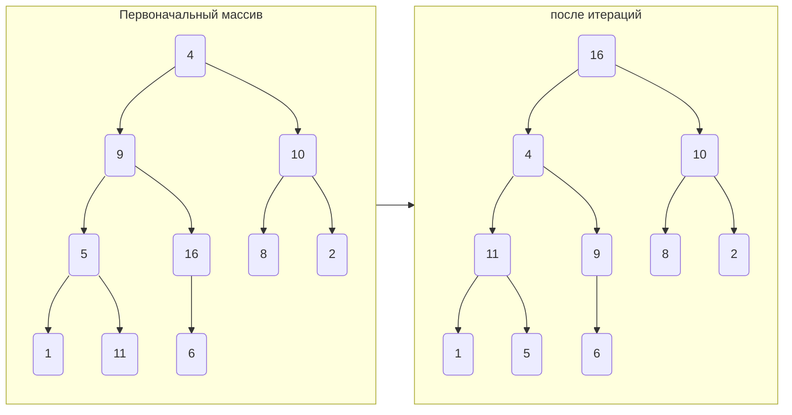
Максимальное значение 16 вывели в начало массива, однако не весь массива выстроился по правилам дерева!

Смысл - алгоритм HEAPsort:

1. отсортировать массив по принципам бинарного дерева:
    * i = 2 * i + 1 <br/> i = 2 * i + 2
    * arr[i] >= arr [2 * i + 1] <br/> arr[i] >= arr [2 * i + 2]
2. После, максимальный элемент т.е. `arr[0]` поменять местами с `arr[arr.length - 1]`
3. Снова сортировка
4. Далее `arr[0]` уже меняем с `arr[arr.length - 2]`
и т.д. чередую сортивку и рокировку до arr[0] и arr[1]

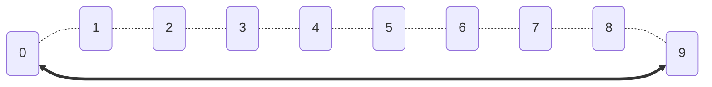
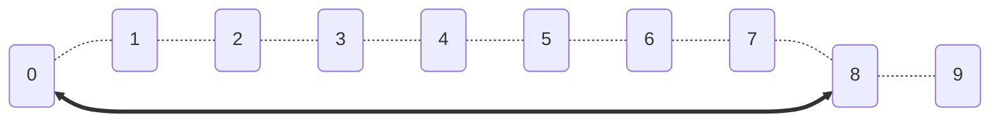
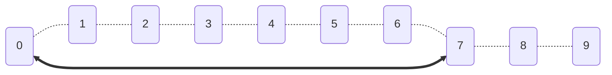
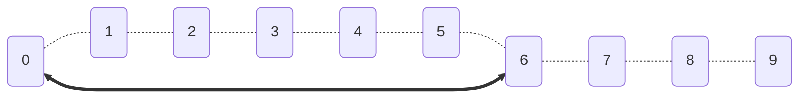
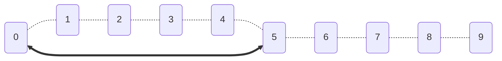
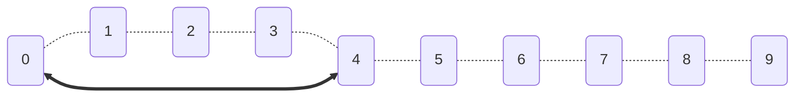
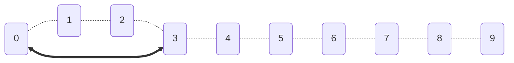
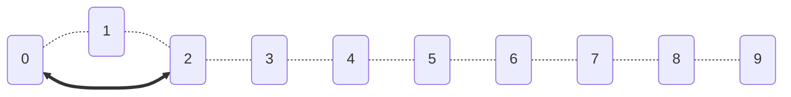
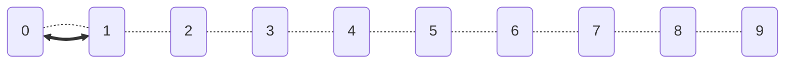
Делаем вывод что для выстраивания дерева И рокировки необходимо проводить итерации справа налево.

```java
for (int i = (arr.length - 1); i >= 0; i--) {
    // наш цикл выстраивания дерева

    //проверка если arr[0] <= arr[j], то нет смысла рокировать (например если одинаковые макс значения были в конце массива)
    if (arr[0] > arr[i]) {
        int temp_sort = arr[0];
        arr[0] = arr[i];
        arr[i] = temp_sort;
    }
}
```
<font size = "6"> <span style="color: red"> НО ! ! ! </span></font>

Если просто вставить наш цикл выстраивания дерева в цикл рокировки, то получим следующее:
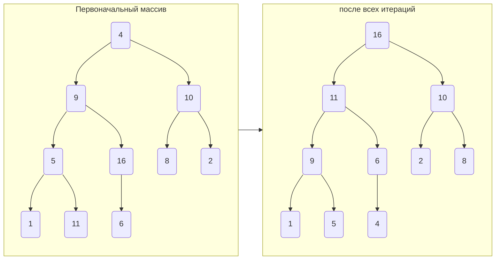
Массив полностью преобразился по принципу бинарного дерева.

Каждый раз после выстраивания дерева и рокировки `arr[0]=16` на `arr[j]` - не ограгичивали следующую итерацию выстраивания дерева.

Каждый раз пробегились от 9 до 0, а должны постоянно снижать индекс на 1 - т.е. следующая итерация д.б. от 8 до 0, далее от 7 до 0 ... последняя от 1 до 0.

Получается, что значение 16 "бегало" к индексам 0->9 ->0->8 ->0->7 ->0->6 ->0->5 ->0->4 ->0->3 ->0->2 ->0->1 ->0, параллельно выстраивался массив про правилам дерева.

Необходимо в цикле выстраивания дерева оптимизировать код, ограничив нашу итерацию массива на 1
```java
for (int i = (arr.length - 1); i >= 0; i--) {
    for (int j = ((i - 1) / 2); i >= 0; j--) {
        int leaf_left = 2 * i + 1;
        int leaf_right = (2 * i + 2) <= i ? (2 * i + 2) : leaf_left;
        // во 2ом цикле указываем i вместо arr.length и в правом листе делаем проверку на i вместо arr.length
        // ... код выстраивания дерева
    }
    if (arr[0] > arr[j]) {
        int temp_sort = arr[0];
        arr[0] = arr[j];
        arr[j] = temp_sort;
    }
}
```
Оптимизируем код полностью, введем переменные до циклов
```java
public class Program {
    public static void main(String[] args) {
        Integer[] numbers_arr = new Integer[] {4, 9, 10, 5, 16, 8, 2, 1, 11, 6};

        int leaf_left = 0;
        int leaf_right = 0;
        int max_value_i = 0;
        int temp = 0;

        for (int j = (numbers_arr.length - 1); j > 0; j--) {
            for (int i = ((j - 1) / 2); i >= 0; i--) {
                leaf_left = 2 * i + 1;
                leaf_right = (2 * i + 2) <= j ? (2 * i + 2) : leaf_left;

                if (numbers_arr[leaf_left] >= numbers_arr[leaf_right]) {
                    max_value_i = leaf_left;
                } else { max_value_i = leaf_right; }

                if (numbers_arr[max_value_i] > numbers_arr[i]) {
                    temp = numbers_arr[i];
                    numbers_arr[i] = numbers_arr[max_value_i];
                    numbers_arr[max_value_i] = temp;
                }
            }
            if (numbers_arr[0] > numbers_arr[j]) {
                temp = numbers_arr[0];
                numbers_arr[0] = numbers_arr[j];
                numbers_arr[j] = temp;
            }
        }
    }
}
```
Можно сделать отдельную void функцию `heapify`, которая принимает на вход массив чисел и конечную позицию индекса
```java
public class Task1 {
    public static void main(String[] args) {
        Integer[] numbers_arr = new Integer[] {4, 9, 10, 5, 16, 8, 2, 1, 11, 6};

        for (int j = (numbers_arr.length - 1); j > 0; j--) {
            heapify(numbers_arr, j);

            if (numbers_arr[0] > numbers_arr[j]) {
                temp = numbers_arr[0];
                numbers_arr[0] = numbers_arr[j];
                numbers_arr[j] = temp;
            }
        }
        System.out.println(numbers_list);
    }

    private static void heapify(Integer[] arr, int last_position) {
        for (int i = ((last_position - 1) / 2); i >= 0; i--) {
            int leaf_left = 2 * i + 1;
            int leaf_right = (2 * i + 2) <= last_position ? (2 * i + 2) : leaf_left;
            int max_value_i = 0;

            if (arr[leaf_left] >= arr[leaf_right]) {
                    max_value_i = leaf_left;
                } else { max_value_i = leaf_right; }

            if (arr[max_value_i] > arr[i]) {
                    int temp = arr[i];
                    arr[i] = arr[max_value_i];
                    arr[max_value_i] = temp;
            }
        }
    }
}
```
Поэтапная сортировка
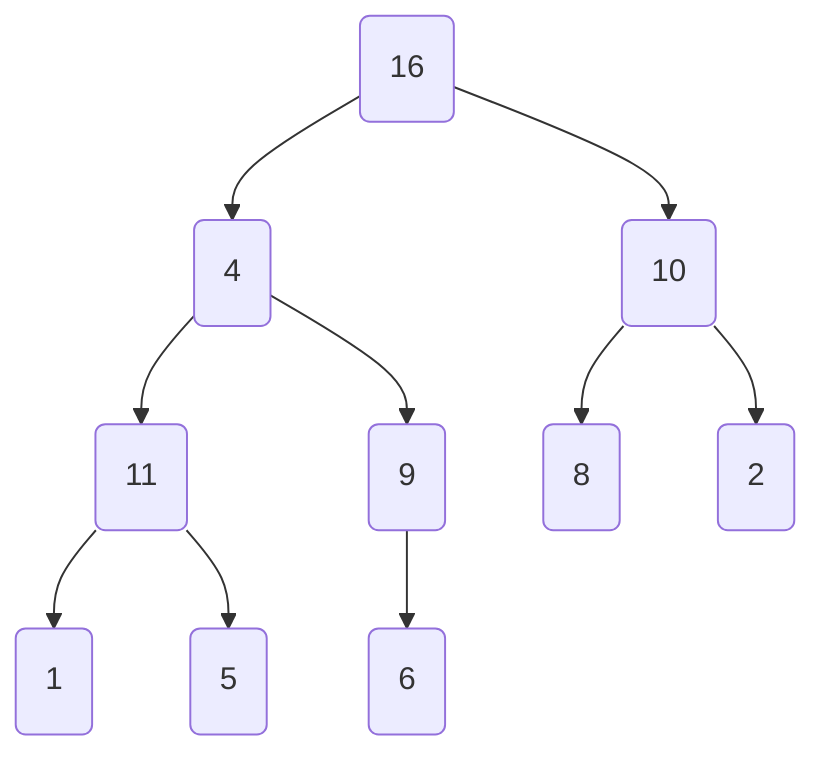
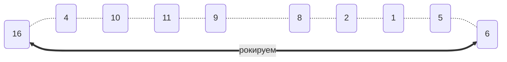
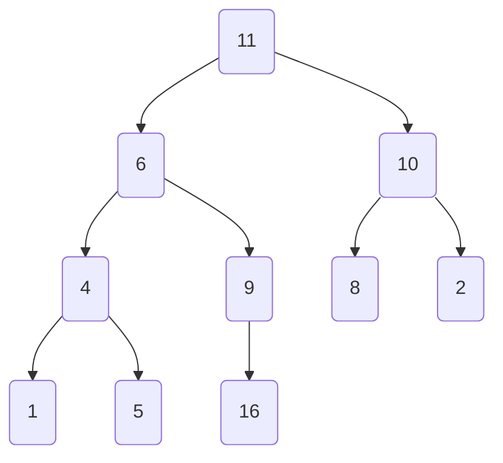
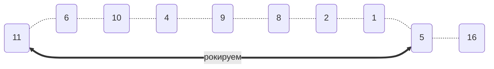
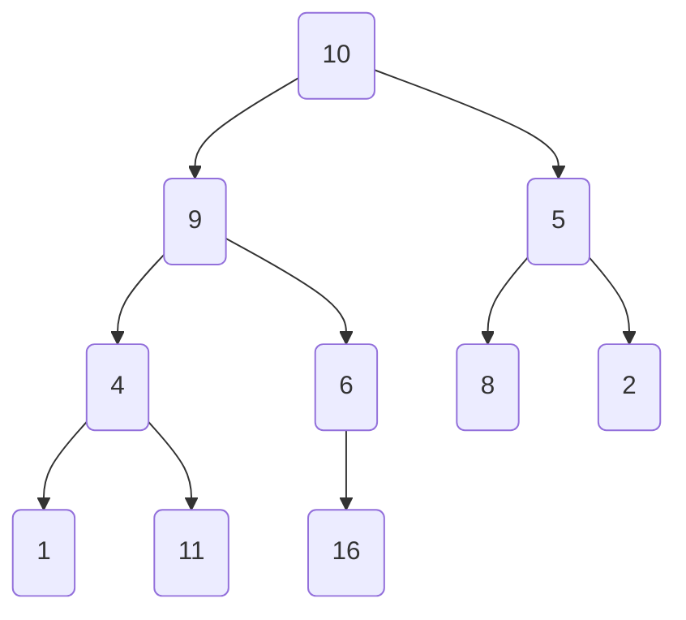
```mermaid
flowchart LR
0("10")
1("9")
2("5")
3("4")
4("6")
5("8")
6("2")
7("1")
8("11")
9("16")
0-.-1-.-2-.-3-.-4-.-5-.-6-.-7-.-8-.-9
0<==>|рокируем|7
```
```mermaid
flowchart TB
0("9")
1("1")
2("8")
3("4")
4("6")
5("5")
6("2")
7("10")
8("11")
9("16")
0-->1 & 2
1-->3 & 4
2-->5 & 6
3-->7 & 8
4-->9
```
```mermaid
flowchart LR
0("9")
1("1")
2("8")
3("4")
4("6")
5("5")
6("2")
7("10")
8("11")
9("16")
0-.-1-.-2-.-3-.-4-.-5-.-6-.-7-.-8-.-9
0<==>|рокируем|6
```
```mermaid
flowchart TB
0("8")
1("6")
2("2")
3("4")
4("1")
5("5")
6("9")
7("10")
8("11")
9("16")
0-->1 & 2
1-->3 & 4
2-->5 & 6
3-->7 & 8
4-->9
```
```mermaid
flowchart LR
0("8")
1("6")
2("2")
3("4")
4("1")
5("5")
6("9")
7("10")
8("11")
9("16")
0-.-1-.-2-.-3-.-4-.-5-.-6-.-7-.-8-.-9
0<==>|рокируем|5
```
```mermaid
flowchart TB
0("6")
1("5")
2("2")
3("4")
4("1")
5("8")
6("9")
7("10")
8("11")
9("16")
0-->1 & 2
1-->3 & 4
2-->5 & 6
3-->7 & 8
4-->9
```
```mermaid
flowchart LR
0("6")
1("5")
2("2")
3("4")
4("1")
5("8")
6("9")
7("10")
8("11")
9("16")
0-.-1-.-2-.-3-.-4-.-5-.-6-.-7-.-8-.-9
0<==>|рокируем|4
```
```mermaid
flowchart TB
0("5")
1("1")
2("2")
3("4")
4("6")
5("8")
6("9")
7("10")
8("11")
9("16")
0-->1 & 2
1-->3 & 4
2-->5 & 6
3-->7 & 8
4-->9
```
```mermaid
flowchart LR
0("5")
1("1")
2("2")
3("4")
4("6")
5("8")
6("9")
7("10")
8("11")
9("16")
0-.-1-.-2-.-3-.-4-.-5-.-6-.-7-.-8-.-9
0<==>|рокируем|3
```
```mermaid
flowchart TB
0("4")
1("1")
2("2")
3("5")
4("6")
5("8")
6("9")
7("10")
8("11")
9("16")
0-->1 & 2
1-->3 & 4
2-->5 & 6
3-->7 & 8
4-->9
```
```mermaid
flowchart LR
0("4")
1("1")
2("2")
3("5")
4("6")
5("8")
6("9")
7("10")
8("11")
9("16")
0-.-1-.-2-.-3-.-4-.-5-.-6-.-7-.-8-.-9
0<==>|рокируем|2
```
```mermaid
flowchart TB
0("2")
1("1")
2("4")
3("5")
4("6")
5("8")
6("9")
7("10")
8("11")
9("16")
0-->1 & 2
1-->3 & 4
2-->5 & 6
3-->7 & 8
4-->9
```
```mermaid
flowchart LR
0("2")
1("1")
2("4")
3("5")
4("6")
5("8")
6("9")
7("10")
8("11")
9("16")
0-.-1-.-2-.-3-.-4-.-5-.-6-.-7-.-8-.-9
0<==>|рокируем|1
```