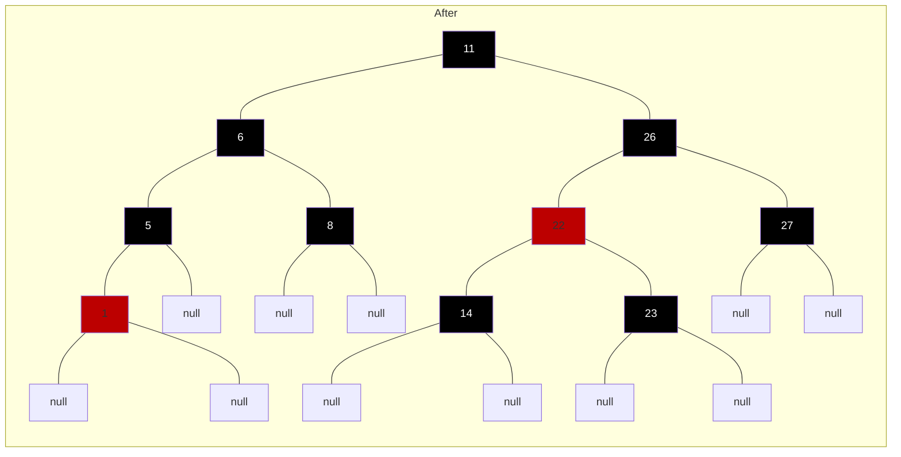
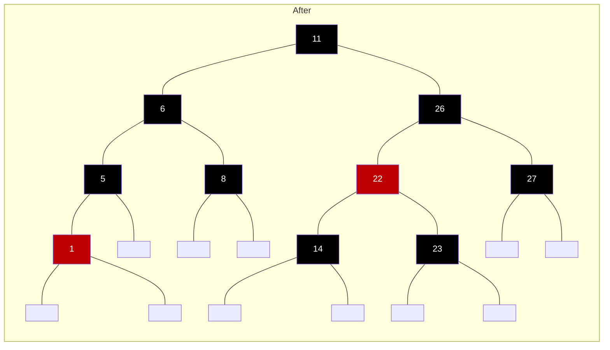
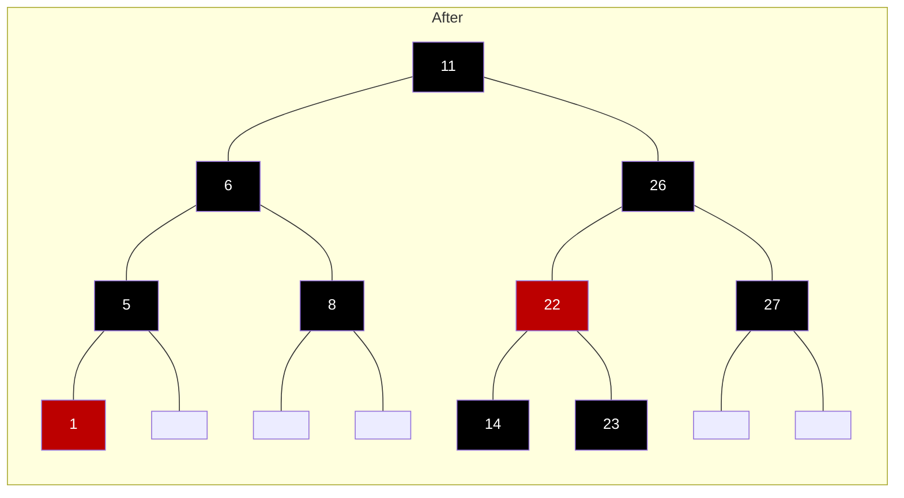

___
```
------Node{value=27,color=RED}
---------Node{value=26,color=RED}
------------Node{value=23,color=RED}
---------------Node{value=22,color=RED}
---Node{value=14,color=RED}
Node{value=11,color=BLACK}
------Node{value=8,color=RED}
---Node{value=6,color=RED}
------Node{value=5,color=RED}
---------Node{value=1,color=RED}
```

___
```
------Node{value=27,color=BLACK}
---Node{value=26,color=BLACK}
---------Node{value=23,color=BLACK}
------Node{value=22,color=RED}
---------Node{value=14,color=BLACK}
Node{value=11,color=BLACK}
------Node{value=8,color=BLACK}
---Node{value=6,color=BLACK}
------Node{value=5,color=BLACK}
---------Node{value=1,color=RED}
```




