# Односвязный
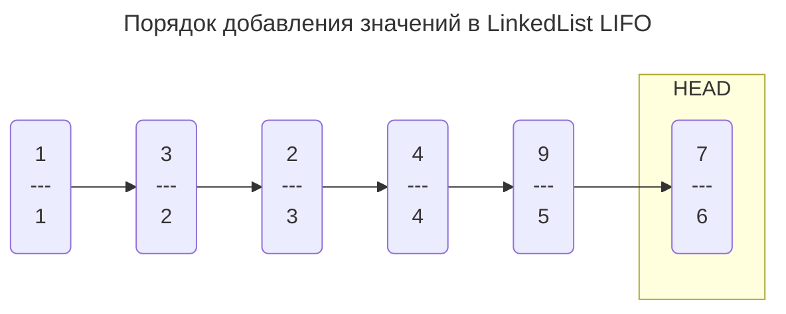
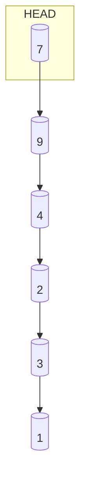
`head` является последним добавленным `узлом`

главным свойством LinkedList LIFO является `узел head`, это своего рода точка отсчета / координат для движения по списку

двигаться мы можем только начиная с `head`

у узлов свойствами являются `value`-значения и `узел next`, который ссылается на предыдущий добавленный `узел`

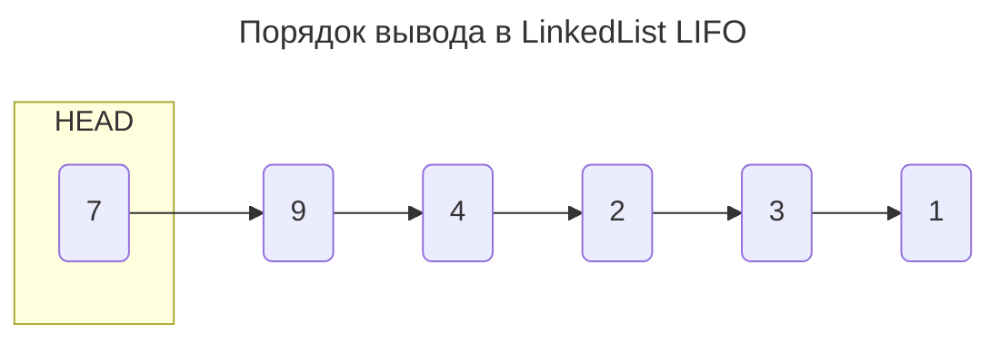
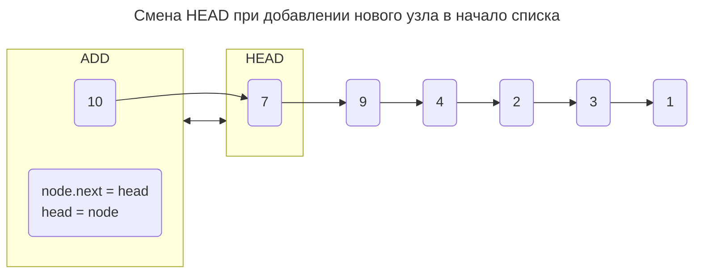
```java
node.next = head
// так как список выводиться методом LIFO, то ссылка на узел next является текущий head(который мы еще не поменяли), т.е. узел со значением 7

head = node
// теперь мы меняем узел head на новый добавленный узел со значением 10
```
При добавлении нового узла в конец списка необходимо будет пройти весь список до самого первого узла через свойство `next`
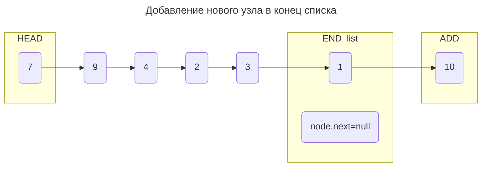
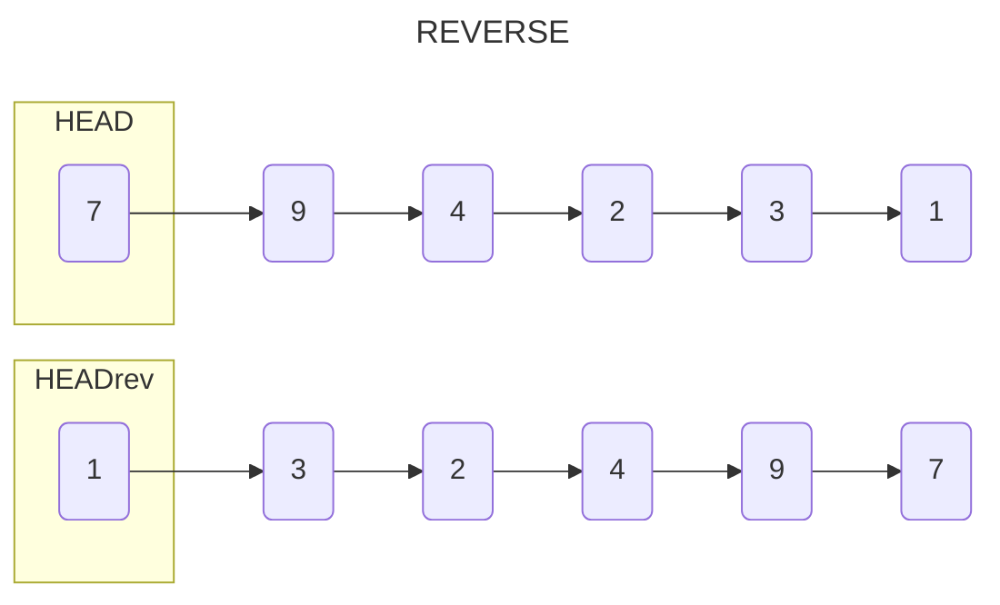
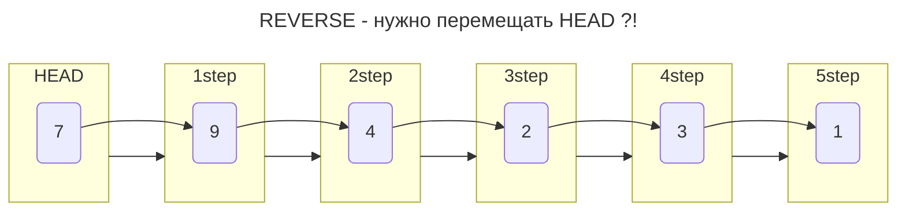
Получается, что `узел head` и `узел next`(одним из свойств узлов `Node`) являются нашими единственными инструментами по **передвижению** по списку
```mermaid
---
title: "ввести переменную Node current (cur) ?!"
---
flowchart LR
1("1")
2("3")
3("2")
4("4")
5("9")
subgraph CUR=HEAD
6("7")
end
6 --> 5 --> 4 --> 3 --> 2 --> 1
```
Перемещать каждый раз `head`, который `cur` или `cur`, который `head` в конец списка?!
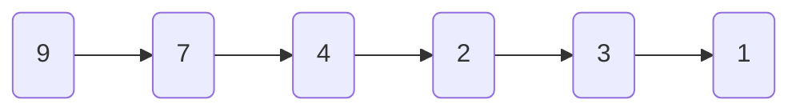
`head` должен всегда оставаться в начале списка, чтобы в дальнейшем мы могли использоваться список корректно
значит перемещаться нужно через `cur`, которая в начале была `head`
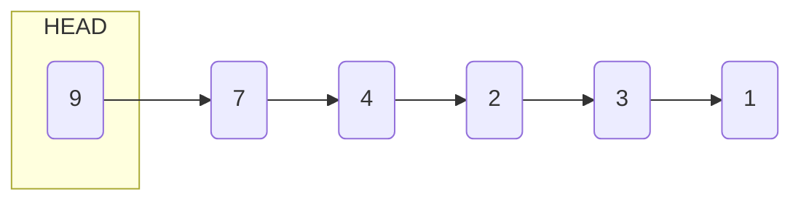
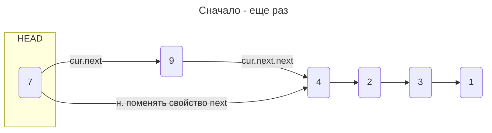
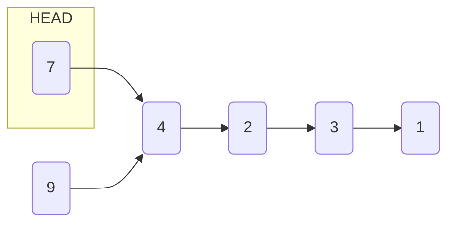
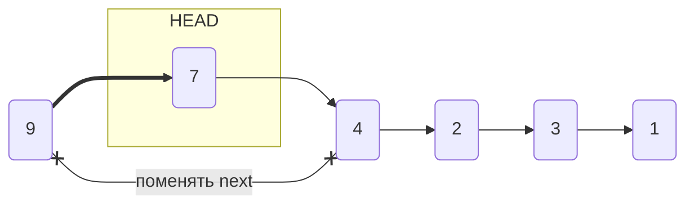
```java
//---------до цикла----------
cur = head; // задаем начальный узел движения по списку перед циклом
next = cur.next; // попробовать использовать next.next в цикле?!
//---------------------------

// 1. нужно у узла cur со значением 7 поменять свойство next на узел со значением 4
cur.next = next.next;

// 2. у узла со значением 9 поменять свойство next на узел со значением 9
cur.next.next = cur;

// 3. как поступить с head?!

cur=cur.next; // позволит нам "передвигаться" по списку (исользоваться в конце цикла?!)


```
